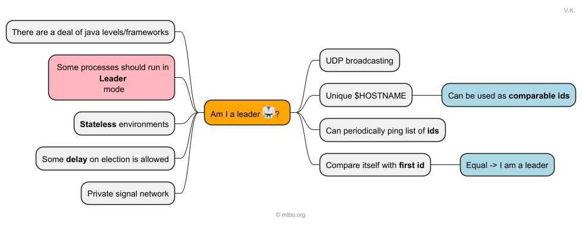
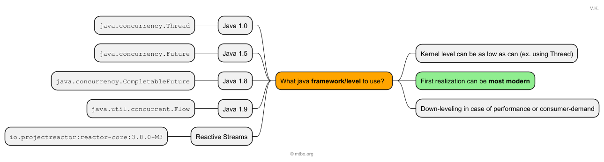

## Java Lightweight Leader Election

## Definition

There is a set of goals:

- For what?
- What **framework** or **language level** to use?
- Which **strategy** to use?

### For what

### Java Version

